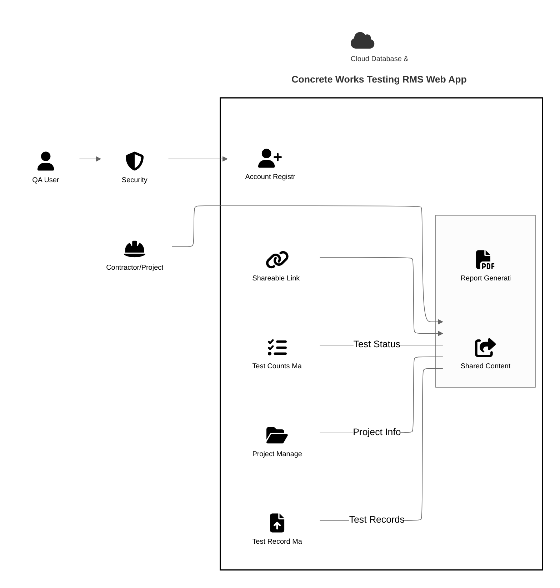

# Conceptual Framework

```mermaid
---
config:
  look: classic
  theme: neutral
  layout: elk
---

graph LR
    subgraph Left ["<div>"]
        User("<h3 class='fa-2xl' style='height:6px'>fa:fa-user</h3><div style='font-size:12px; width:7em'>QA User")
        Security(" <h3 class='fa-2xl' style='height:6px'>fa:fa-shield-alt</h3><div style='  font-size:12px; width:7em'>Security")
        Contractor(" <h3 class='fa-2xl' style='height:6px'>fa:fa-helmet-safety</h3><div style='  font-size:12px; width:8em'>Contractor/Project Engineer User")
    end

    subgraph Main ["<div style='display:flex; justify-content:center;'>"]

        subgraph App ["<div style='visibility:hidden;'>Main App Box</div>"]

            F1[" <h3 class='fa-2xl' style='height:6px'>fa:fa-user-plus</h3><div style='margin-bottom:10px;font-size:12px; width:7em'>Account Registration</div>"]
            subgraph Shared ["<div>"]
                ShareContent[" <h3 class='fa-2xl' style='height:6px'>fa:fa-share-from-square</h3><div style='  font-size:12px; width:7em'>Shared Content</div>"]
                F5[" <h3 class='fa-2xl' style='height:6px'>fa:fa-file-pdf</h3><div style='  font-size:12px; width:7em'>Report Generation</div>"]
            end

            subgraph Col2 ["<div>"]
                F2[" <h3 class='fa-2xl' style='height:6px'>fa:fa-folder-open</h3><div style='  font-size:12px; width:7em'>Project Management</div>"]
                F3[" <h3 class='fa-2xl' style='height:6px'>fa:fa-link</h3><div style='  font-size:12px; width:7em'>Shareable Link Generation</div>"]
                F4[" <h3 class='fa-2xl' style='height:6px'>fa:fa-file-upload</h3><div style='  font-size:12px; width:7em'>Test Record Management</div>"]
                F6[" <h3 class='fa-2xl' style='height:6px'>fa:fa-tasks</h3><div style='  font-size:12px; width:7em'>Test Counts Management</div>"]
            end
        end

        subgraph Cloud ["<div> <h3 class='fa-2xl' style='height:6px'>fa:fa-cloud</h3><div style='  font-size:12px; width:8em'>Cloud Database & Storage</div></div>"]
            subgraph AppName ["<div style='text-align:center; text-justify:center; width:25em; font-weight:bold;'>Concrete Works Testing RMS Web App</div>"]
            end
        end
    end

    User --> Security
    Security -->  F1

    F2 --"Project Info"--- ShareContent
    F4 --"Test Records"--- ShareContent
    F6 --"Test Status"--- ShareContent
    F3 --> ShareContent

    Contractor --> ShareContent

    classDef iconNode fill:transparent,stroke:transparent,color:black,fontSize:16px
    class User,Security,Contractor iconNode

    classDef featureBox fill:transparent,stroke:transparent
    class F1,F2,F3,F4,F5,F6,F7,Cloud,Left,Main,ShareContent featureBox

    style App fill:transparent,stroke:black,stroke-width:2px,borderRadius:15px

    style Col2 fill:transparent,stroke:transparent
```
