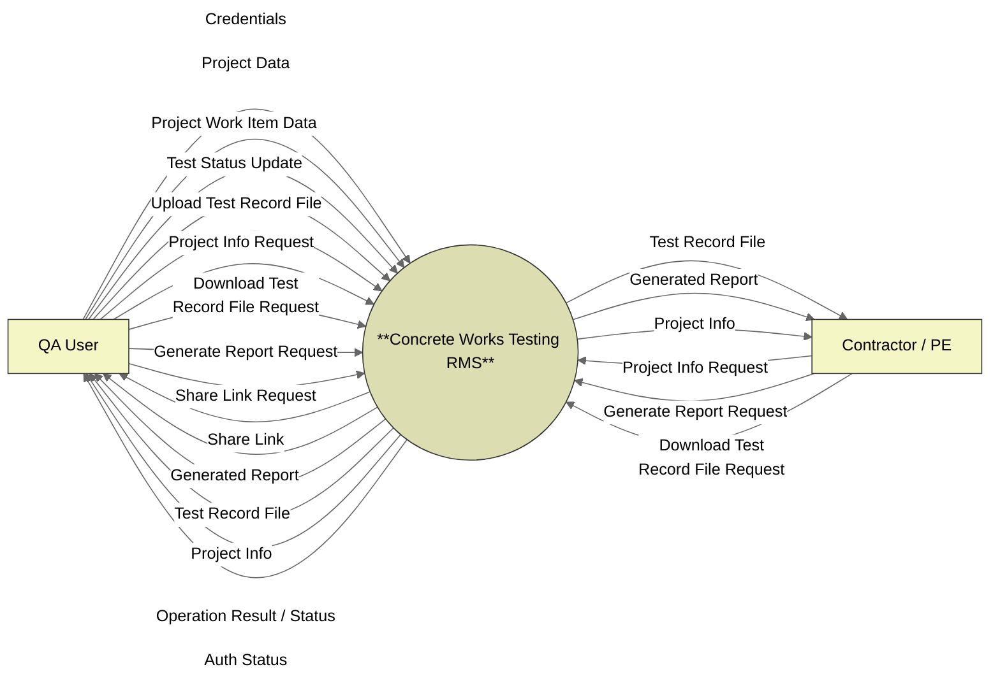

## Context Diagram

```mermaid
---
config:
  look: classic
  theme: neutral
---

graph LR
    QA[QA User]
    Contractor[Contractor / PE]
    System_RMS((**Concrete Works Testing RMS**))
    QA -- "Credentials" --> System_RMS
    QA -- "Project Data" --> System_RMS
    QA -- "Project Work Item Data" --> System_RMS 
    QA -- "Test Status Update" --> System_RMS 
    QA -- "Upload Test Record File" --> System_RMS
    QA -- "Project Info Request" --> System_RMS
    QA -- "Download Test 
    Record File Request" --> System_RMS
    QA -- "Generate Report Request" --> System_RMS
    QA -- "Share Link Request" --> System_RMS
    System_RMS -- "Share Link" --> QA
    System_RMS -- "Generated Report" --> QA
    System_RMS -- "Test Record File" --> QA
    System_RMS -- "Project Info" --> QA
    System_RMS -- "Operation Result / Status" --> QA
    System_RMS -- "Auth Status" --> QA
 
    Contractor -- "Project Info Request" --> System_RMS 
    Contractor -- "Generate Report Request" --> System_RMS
    Contractor -- "Download Test
    Record File Request" --> System_RMS
    System_RMS -- "Test Record File" --> Contractor
    System_RMS -- "Generated Report" --> Contractor 
    System_RMS -- "Project Info" --> Contractor 

    classDef external fill:#f5f6c5,stroke:#333,stroke-width:1px;
    classDef system fill:#dcddb0,stroke:#333,stroke-width:1px;
    class QA,Contractor external;
    class System_RMS system;
```
