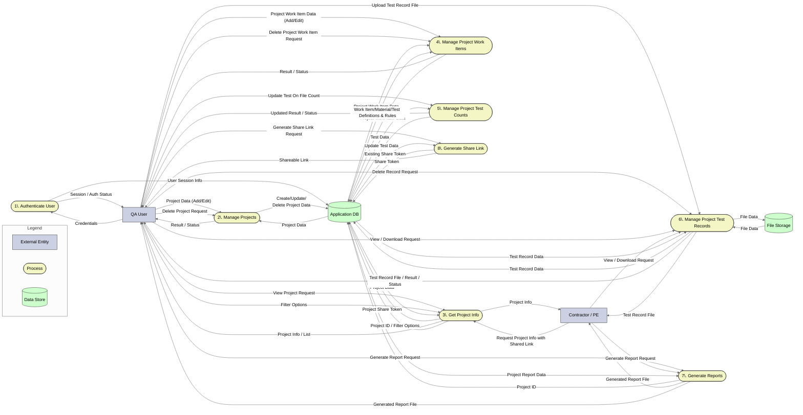

## Data Flow Diagram

```mermaid
---
config:
  theme: neutral
---
flowchart LR
%% ENTITIES
    QA["QA User"]
    Contractor["Contractor / PE"]

    subgraph Legend
    direction LR
    external[External Entity]
    class external external
    process([Process])
    class process process
    store[(Data Store)]
    class store store
    end

%% PROCESSES
    1([1\. Authenticate User])
    2([2\. Manage Projects])
    3([3\. Get Project Info])
    4([4\. Manage Project Work Items])
    5([5\. Manage Project Test Counts])
    6([6\. Manage Project Test Records])
    7([7\. Generate Reports])
    8([8\. Generate Share Link])

%% DATA STORES
    D1[("Application DB")]
    D2[("File Storage")]

%% AUTHENTICATION FLOW
    QA -- "Credentials" --> 1
    1 -- "Session / Auth Status" --> QA
    1 -- "User Session Info" --> D1

%% PROJECT MANAGEMENT FLOW
    QA -- "Project Data (Add/Edit)" --> 2
    QA -- "Delete Project Request" --> 2
    2 -- "Result / Status" --> QA
    2 -- "Create/Update/
    Delete Project Data" --> D1
    D1 -- "Project Data" --> 2

%% READ PROJECT/S FLOW
    QA -- "View Project Request" --> 3
    QA -- "Filter Options" --> 3
    3 -- "Project ID / Filter Options" --> D1
    3 -- "Project Info / List" --> QA
    D1 -- "Project Data" --> 3

%% PROJECT WORK ITEMS MANAGEMENT FLOW
    QA -- "Project Work Item Data (Add/Edit)" --> 4
    QA -- "Delete Project Work Item Request" --> 4
    4 -- "Result / Status" --> QA
    4 -- "Create/Update/Delete Project Work Item Data" --> D1
    D1 -- "Project Work Item Data" --> 4
    D1 -- "Work Item/Material/Test Definitions & Rules" --> 4

%% MANAGE PROJECT TEST COUNTS FLOW
    QA -- "Update Test On File Count" --> 5
    5 -- "Updated Result / Status" --> QA
    5 -- "Update Test Data" --> D1
    D1 -- "Test Data" --> 5

%% MANAGE PROJECT TEST RECORDS FLOW
    QA -- "Upload Test Record File" --> 6
    QA -- "Delete Record Request" --> 6
    QA -- "View / Download Request" --> 6
    Contractor -- "View / Download Request" --> 6
    6 -- "File Data" --> D2
    6 -- "Test Record Data" --> D1
    D2 -- "File Data" --> 6
    D1 -- "Test Record Data" --> 6
    6 -- "Test Record File / Result / Status" --> QA
    6 -- "Test Record File" --> Contractor

%% GENERATE REPORT FLOW
    QA -- "Generate Report Request" --> 7
    Contractor -- "Generate Report Request" --> 7
    7 -- "Project ID" --> D1
    D1 -- "Project Report Data" --> 7
    7 -- "Generated Report File" --> Contractor
    7 -- "Generated Report File" --> QA

%% GENERATE SHARE LINK FLOW
    QA -- "Generate Share Link Request" --> 8
    8 -- "Share Token" --> D1
    D1 -- "Existing Share Token" --> 8
    8 -- "Shareable Link" --> QA

%% GET SHARED PROJECT INFO FLOW
    Contractor -- "Request Project Info with Shared Link" --> 3
    3 -- "Project Share Token" --> D1
    3 -- "Project Info" --> Contractor

    classDef external fill:#cbd0e2,stroke:#333,stroke-width:1px;
    classDef process fill:#f5f6c5,stroke:#333,stroke-width:1px;
    classDef store fill:#cfc,stroke:#333,stroke-width:1px;

    class QA,Contractor external;
    class 1,2,3,4,5,6,7,8 process;
    class D1,D2 store;
```
