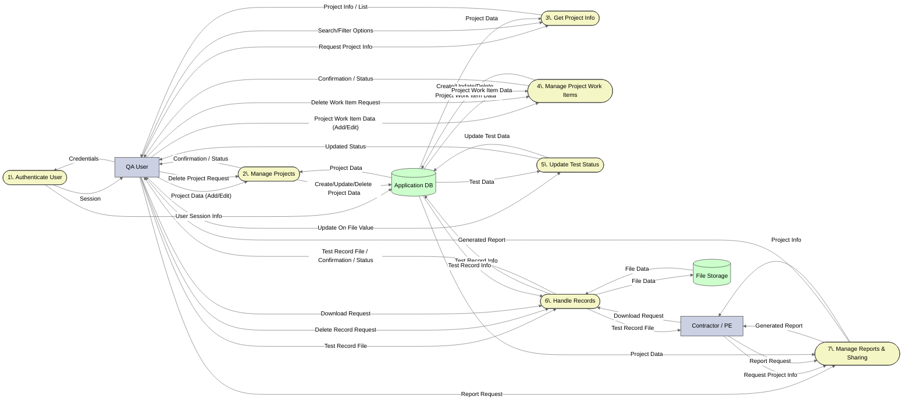

## Data Flow Diagram

```mermaid
---
config:
  theme: neutral
---
flowchart LR
    QA["QA User"]
    Contractor["Contractor / PE"]
 
    1([1\. Authenticate User])
    2([2\. Manage Projects]) 
    3([3\. Get Project Info])
    4([4\. Manage Project Work Items])
    5([5\. Update Test Status])
    6([6\. Handle Records])
    7([7\. Manage Reports & Sharing])

    D1[("Application DB")]
    D2[("File Storage")]

    QA -- "Credentials" --> 1
    1 -- "Session" --> QA
    1 -- "User Session Info" --> D1

    QA -- "Project Data (Add/Edit)" --> 2
    QA -- "Delete Project Request" --> 2
    2 -- "Confirmation / Status" --> QA
    2 -- "Create/Update/Delete Project Data" --> D1
    D1 -- "Project Data" --> 2

    QA -- "Request Project Info" --> 3
    QA -- "Search/Filter Options" --> 3
    3 -- "Project Info / List" --> QA
    D1 -- "Project Data" --> 3

    QA -- "Project Work Item Data (Add/Edit)" --> 4
    QA -- "Delete Work Item Request" --> 4
    4 -- "Confirmation / Status" --> QA
    4 -- "Create/Update/Delete Project Work Item Data" --> D1
    D1 -- "Project Work Item Data" --> 4

    QA -- "Update On File Value" --> 5
    5 -- "Updated Status" --> QA
    5 -- "Update Test Data" --> D1
    D1 -- "Test Data" --> 5

    QA -- "Test Record File" --> 6 
    QA -- "Delete Record Request" --> 6
    QA -- "Download Request" --> 6
    6 -- "File Data" --> D2 
    6 -- "Test Record Info" --> D1 
    D2 -- "File Data" --> 6
    D1 -- "Test Record Info" --> 6 
    6 -- "Test Record File / Confirmation / Status" --> QA
    6 -- "Test Record File" --> Contractor

    QA -- "Report Request" --> 7
    Contractor -- "Request Project Info" --> 7
    Contractor -- "Report Request" --> 7
    Contractor -- "Download Request" --> 6
    D1 -- "Project Data" --> 7
    7 -- "Generated Report" --> Contractor
    7 -- "Generated Report" --> QA
    7 -- "Project Info" --> Contractor

    classDef external fill:#cbd0e2,stroke:#333,stroke-width:1px;
    classDef process fill:#f5f6c5,stroke:#333,stroke-width:1px;
    classDef store fill:#cfc,stroke:#333,stroke-width:1px;

    class QA,Contractor external;
    class 1,2,3,4,5,6,7 process;
    class D1,D2 store;
```
