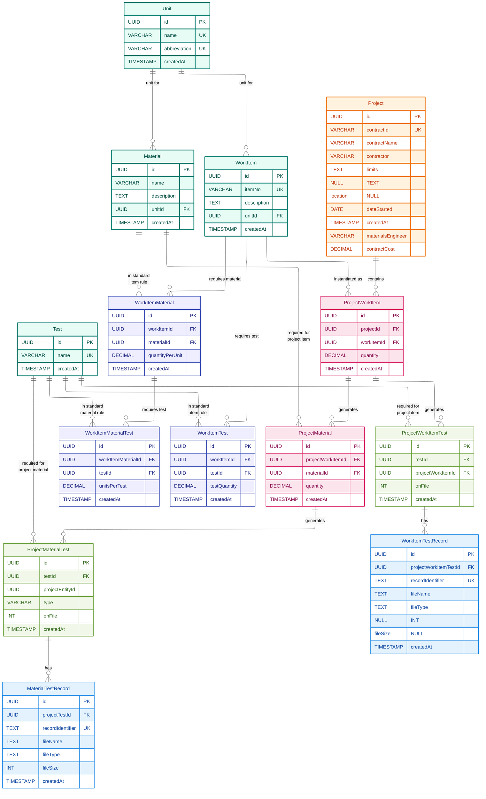

## Entity Relationship Diagram

```mermaid
---
config:
  layout: elk
  theme: neutral
---
erDiagram
    direction TB
    Unit {
        UUID id PK
        VARCHAR name UK
        VARCHAR abbreviation UK
        TIMESTAMP createdAt
    }
    class Unit coreDef
    Material {
        UUID id PK
        VARCHAR name
        TEXT description
        UUID unitId FK
        TIMESTAMP createdAt
    }
    class Material coreDef
    WorkItem {
        UUID id PK
        VARCHAR itemNo UK
        TEXT description
        UUID unitId FK
        TIMESTAMP createdAt
    }
    class WorkItem coreDef
    Test {
        UUID id PK
        VARCHAR name UK
        TIMESTAMP createdAt
    }
    class Test coreDef
    WorkItemMaterial {
        UUID id PK
        UUID workItemId FK
        UUID materialId FK
        DECIMAL quantityPerUnit
        TIMESTAMP createdAt
    }
    class WorkItemMaterial standardRule
    WorkItemMaterialTest {
        UUID id PK
        UUID workItemMaterialId FK
        UUID testId FK
        DECIMAL unitsPerTest
        TIMESTAMP createdAt
    }
    class WorkItemMaterialTest standardRule
    WorkItemTest {
        UUID id PK
        UUID workItemId FK
        UUID testId FK
        DECIMAL testQuantity
        TIMESTAMP createdAt
    }
    class WorkItemTest standardRule
    Project {
        UUID id PK
        VARCHAR contractId UK
        VARCHAR contractName
        VARCHAR contractor
        TEXT limits NULL
        TEXT location NULL
        DATE dateStarted
        TIMESTAMP createdAt
        VARCHAR materialsEngineer
        DECIMAL contractCost
    }
    class Project projectCore
    ProjectWorkItem {
        UUID id PK
        UUID projectId FK
        UUID workItemId FK
        DECIMAL quantity
        TIMESTAMP createdAt
    }
    class ProjectWorkItem projectInstance
    ProjectMaterial {
        UUID id PK
        UUID projectWorkItemId FK
        UUID materialId FK
        DECIMAL quantity
        TIMESTAMP createdAt
    }
    class ProjectMaterial projectInstance
    ProjectMaterialTest {
        UUID id PK
        UUID testId FK
        UUID projectEntityId
        VARCHAR type
        INT onFile
        TIMESTAMP createdAt
    }
    class ProjectMaterialTest projectTest
    ProjectWorkItemTest {
        UUID id PK
        UUID testId FK
        UUID projectWorkItemId FK
        INT onFile
        TIMESTAMP createdAt
    }
    class ProjectWorkItemTest projectTest
    MaterialTestRecord {
        UUID id PK
        UUID projectTestId FK
        TEXT recordIdentifier UK
        TEXT fileName
        TEXT fileType
        INT fileSize
        TIMESTAMP createdAt
    }
    class MaterialTestRecord testRecord
    WorkItemTestRecord {
        UUID id PK
        UUID projectWorkItemTestId FK
        TEXT recordIdentifier UK
        TEXT fileName
        TEXT fileType NULL
        INT fileSize NULL
        TIMESTAMP createdAt
    }

    class WorkItemTestRecord testRecord

    Unit                 ||--o{ Material             : "unit for"
    Unit                 ||--o{ WorkItem             : "unit for"

    Material             ||--o{ WorkItemMaterial     : "in standard
    item rule"
    Material             ||--o{ ProjectMaterial      : "required for
    project item"

    WorkItem             ||--o{ WorkItemMaterial     : "requires material"
    WorkItem             ||--o{ WorkItemTest         : "requires test"
    WorkItem             ||--o{ ProjectWorkItem      : "instantiated as"

    WorkItemMaterial     ||--o{ WorkItemMaterialTest : "requires test"

    Test                 ||--o{ WorkItemMaterialTest : "in standard
    material rule"
    Test                 ||--o{ WorkItemTest         : "in standard
    item rule"

    Test                 ||--o{ ProjectMaterialTest  : "required for
    project material"
    Test                 ||--o{ ProjectWorkItemTest  : "required for
    project item"

    Project              ||--o{ ProjectWorkItem      : "contains"

    ProjectWorkItem      ||--o{ ProjectMaterial      : "generates"
    ProjectWorkItem      ||--o{ ProjectWorkItemTest  : "generates"

    ProjectMaterial      ||--o{ ProjectMaterialTest  : "generates"

    ProjectMaterialTest  ||--o{ MaterialTestRecord   : "has"
    ProjectWorkItemTest  ||--o{ WorkItemTestRecord   : "has"

    classDef coreDef fill:#e6fcf5,stroke:#00796b,stroke-width:2px,color:#004d40;
    classDef standardRule fill:#eef,stroke:#3f51b5,stroke-width:1px,color:#1a237e;
    classDef projectCore fill:#fff3e0,stroke:#ef6c00,stroke-width:2px,color:#bf360c;
    classDef projectInstance fill:#fce4ec,stroke:#d81b60,stroke-width:1px,color:#880e4f;
    classDef projectTest fill:#f1f8e9,stroke:#689f38,stroke-width:1px,color:#33691e;
    classDef testRecord fill:#e3f2fd,stroke:#1e88e5,stroke-width:1px,color:#0d47a1;
```
